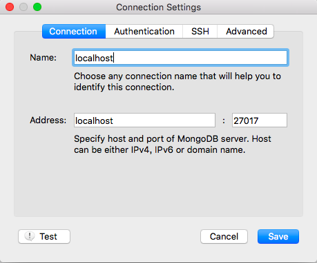
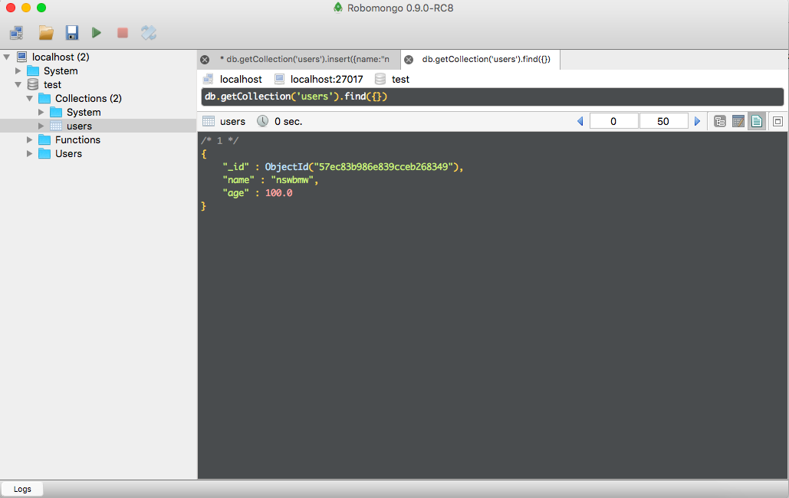
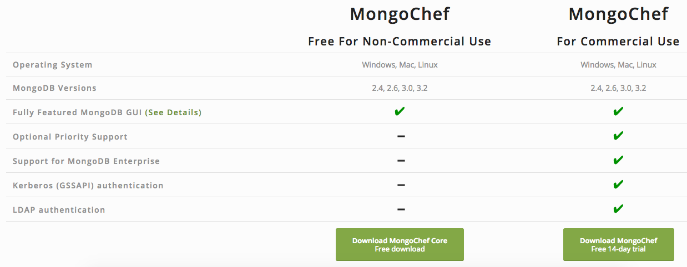
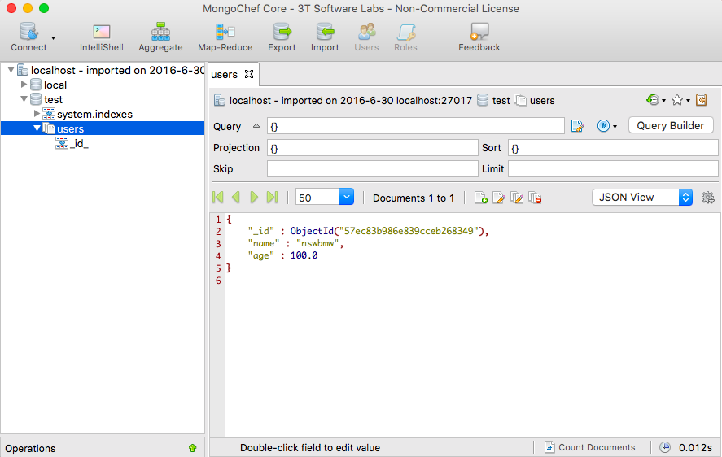
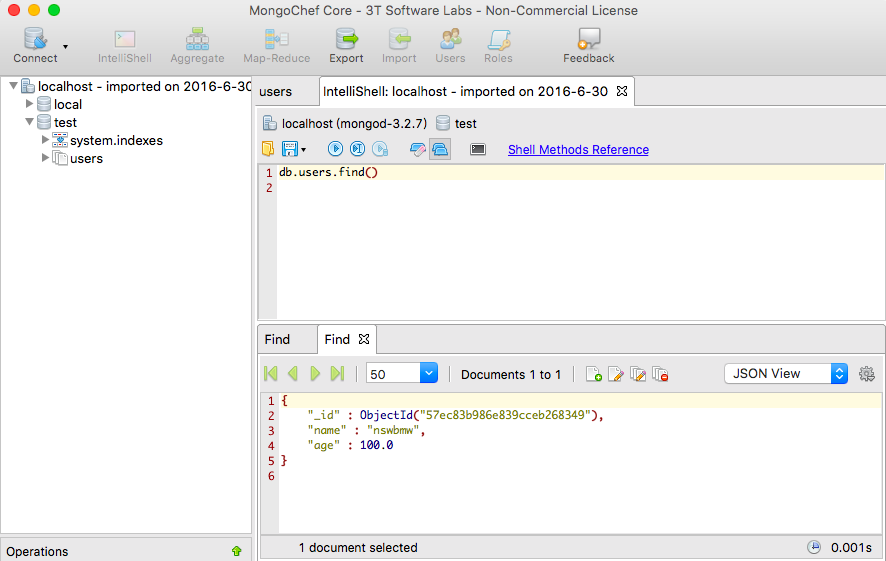

## 1.2.1 安装与启动 MongoDB

- Windows 用户向导：https://docs.mongodb.com/manual/tutorial/install-mongodb-on-windows/
- Linux 用户向导：https://docs.mongodb.com/manual/administration/install-on-linux/
- Mac 用户向导：https://docs.mongodb.com/manual/tutorial/install-mongodb-on-os-x/

## 1.2.2 Robomongo 和 Mongochef

#### Robomongo

[Robomongo](https://robomongo.org/) 是一个基于 Shell 的跨平台开源 MongoDB 可视化管理工具，支持 Windows、Linux 和 Mac，嵌入了 JavaScript 引擎和 MongoDB mongo，只要你会使用 mongo shell，你就会使用 Robomongo，它还提了供语法高亮、自动补全、差别视图等。

[Robomongo 下载地址](https://robomongo.org/download)

下载并安装成功后点击左上角的 `Create` 创建一个连接，给该连接起个名字如: `localhost`，使用默认地址（localhost）和端口（27017）即可，点击 `Save` 保存。

双击 `localhost` 连接到 MongoDB 并进入交互界面，尝试插入一条数据并查询出来，如下所示:

#### MongoChef

[MongoChef](http://3t.io/mongochef/) 是另一款强大的 MongoDB 可视化管理工具，支持 Windows、Linux 和 Mac。

[MongoChef 下载地址](http://3t.io/mongochef/#mongochef-download-compare)，我们选择左侧的非商业用途的免费版下载。

安装成功后跟 Robomongo 一样，也需要创建一个新的连接的配置，成功后双击进入到 MongoChef 主页面，如下所示:

还可以使用 shell 模式:

> 小提示: MongoChef 相较于 Robomongo 更强大一些，但 Robomongo 比较轻量也能满足大部分的常规需求，所以哪一个适合自己还需读者自行尝试。

上一节：[1.1 Node.js 的安装与使用](https://github.com/nswbmw/N-blog/blob/master/book/1.1%20Node.js%20%E7%9A%84%E5%AE%89%E8%A3%85%E4%B8%8E%E4%BD%BF%E7%94%A8.md)

下一节：[2.1 require](https://github.com/nswbmw/N-blog/blob/master/book/2.1%20require.md)