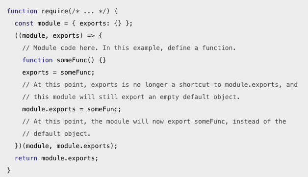

require 用来加载代码，而 exports 和 module.exports 则用来导出代码。

很多新手可能会迷惑于 exports 和 module.exports 的区别，为了更好的理解 exports 和 module.exports 的关系，我们先来巩固下 js 的基础。示例：

**test.js**

```
var a = {name: 1};
var b = a;

console.log(a);
console.log(b);

b.name = 2;
console.log(a);
console.log(b);

var b = {name: 3};
console.log(a);
console.log(b);
```

运行 test.js 结果为：

```
{ name: 1 }
{ name: 1 }
{ name: 2 }
{ name: 2 }
{ name: 2 }
{ name: 3 }
```

**解释**：a 是一个对象，b 是对 a 的引用，即 a 和 b 指向同一块内存，所以前两个输出一样。当对 b 作修改时，即 a 和 b 指向同一块内存地址的内容发生了改变，所以 a 也会体现出来，所以第三四个输出一样。当 b 被覆盖时，b 指向了一块新的内存，a 还是指向原来的内存，所以最后两个输出不一样。

明白了上述例子后，我们只需知道三点就知道 exports 和 module.exports 的区别了：

1. module.exports 初始值为一个空对象 {}
2. exports 是指向的 module.exports 的引用
3. require() 返回的是 module.exports 而不是 exports

Node.js 官方文档的截图证实了我们的观点:



#### exports = module.exports = {...}

我们经常看到这样的写法：

```
exports = module.exports = {...}
```

上面的代码等价于:

```
module.exports = {...}
exports = module.exports
```

原理很简单：module.exports 指向新的对象时，exports 断开了与 module.exports 的引用，那么通过 exports = module.exports 让 exports 重新指向 module.exports。

> 小提示：ES6 的 import 和 export 不在本文的讲解范围，有兴趣的读者可以去学习阮一峰老师的[《ECMAScript6入门》](http://es6.ruanyifeng.com/)。

上一节：[2.1 require](https://github.com/nswbmw/N-blog/blob/master/book/2.1%20require.md)

下一节：[2.3 Promise](https://github.com/nswbmw/N-blog/blob/master/book/2.3%20Promise.md)