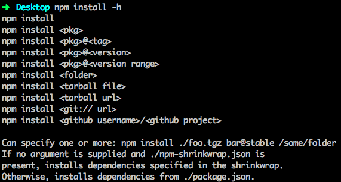

## 2.6.1 npm init

使用 `npm init` 初始化一个空项目是一个好的习惯，即使你对 package.json 及其他属性非常熟悉，`npm init` 也是你开始写新的 Node.js 应用或模块的一个快捷的办法。`npm init` 有智能的默认选项，比如从根目录名称推断模块名称，通过 `~/.npmrc` 读取你的信息，用你的 Git 设置来确定 repository 等等。

## 2.6.2 npm install

`npm install` 是我们最常用的 npm 命令之一，因此我们需要好好了解下这个命令。终端输入 `npm install -h` 查看使用方式:



可以看出：我们通过 `npm install` 可以安装 npm 上发布的某个版本、某个tag、某个版本区间的模块，甚至可以安装本地目录、压缩包和 git/github 的库作为依赖。

> 小提示: `npm i` 是 `npm install` 的简写，建议使用 `npm i`。

直接使用 `npm i` 安装的模块是不会写入 package.json 的 dependencies (或 devDependencies)，需要额外加个参数:

1. `npm i express --save`/`npm i express -S` (安装 express，同时将 `"express": "^4.14.0"` 写入 dependencies )
2. `npm i express --save-dev`/`npm i express -D` (安装 express，同时将 `"express": "^4.14.0"` 写入 devDependencies )
3. `npm i express --save --save-exact` (安装 express，同时将 `"express": "4.14.0"` 写入 dependencies )

第三种方式将固定版本号写入 dependencies，建议线上的 Node.js 应用都采取这种锁定版本号的方式，因为你不可能保证第三方模块下个小版本是没有验证 bug 的，即使是很流行的模块。拿 Mongoose 来说，Mongoose 4.1.4 引入了一个 bug 导致调用一个文档 entry 的 remove 会删除整个集合的文档，见：[https://github.com/Automattic/mongoose/blob/master/History.md#415--2015-09-01](https://github.com/Automattic/mongoose/blob/master/History.md#415--2015-09-01)。

> 后面会介绍更安全的 `npm shrinkwrap` 的用法。

运行以下命令：

```
npm config set save-exact true
```

这样每次 `npm i xxx --save` 的时候会锁定依赖的版本号，相当于加了 `--save-exact` 参数。

> 小提示：`npm config set` 命令将配置写到了 ~/.npmrc 文件，运行 `npm config list` 查看。

## 2.6.3 npm scripts

npm 提供了灵活而强大的 scripts 功能，见 [官方文档](https://docs.npmjs.com/misc/scripts)。

npm 的 scripts 有一些内置的缩写命令，如常用的：

- `npm start` 等价于 `npm run start` 
- `npm test` 等价于 `npm run test` 

## 2.6.4 npm shrinkwrap

前面说过要锁定依赖的版本，但这并不能完全防止意外情况的发生，因为锁定的只是最外一层的依赖，而里层依赖的模块的 package.json 有可能写的是 `"mongoose": "*"`。为了彻底锁定依赖的版本，让你的应用在任何机器上安装的都是同样版本的模块（不管嵌套多少层），通过运行 `npm shrinkwrap`，会在当前目录下产生一个 `npm-shrinkwrap.json`，里面包含了通过 node_modules 计算出的模块的依赖树及版本。上面的截图也显示：只要目录下有 npm-shrinkwrap.json 则运行 `npm install` 的时候会优先使用 npm-shrinkwrap.json 进行安装，没有则使用 package.json 进行安装。

更多阅读：

1. https://docs.npmjs.com/cli/shrinkwrap
2. http://tech.meituan.com/npm-shrinkwrap.html

> 注意: 如果 node_modules 下存在某个模块（如直接通过 `npm install xxx` 安装的）而 package.json 中没有，运行 `npm shrinkwrap` 则会报错。另外，`npm shrinkwrap` 只会生成 dependencies 的依赖，不会生成 devDependencies 的。

上一节：[2.5 packge.json](https://github.com/nswbmw/N-blog/blob/master/book/2.5%20package.json.md)

下一节：[3.1 初始化一个 Express 项目](https://github.com/nswbmw/N-blog/blob/master/book/3.1%20%E5%88%9D%E5%A7%8B%E5%8C%96%E4%B8%80%E4%B8%AA%20Express%20%E9%A1%B9%E7%9B%AE.md)