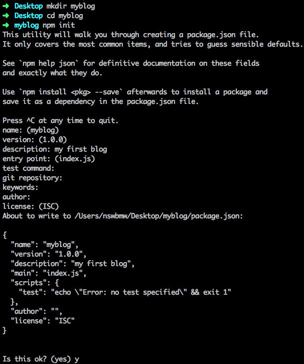
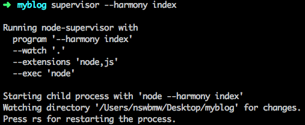

首先，我们新建一个目录 myblog，在该目录下运行 `npm init` 生成一个 package.json，如下所示：



> 注意：括号里的是默认值，如果使用默认值则直接回车即可，否则输入自定义内容后回车。

然后安装 express 并写入 package.json：

```
npm i express@4.14.0 --save 
```

新建 index.js，添加如下代码：

```
var express = require('express');
var app = express();

app.get('/', function(req, res) {
  res.send('hello, express');
});

app.listen(3000);
```

以上代码的意思是：生成一个 express 实例 app，挂载了一个根路由控制器，然后监听 3000 端口并启动程序。运行 `node index`，打开浏览器访问 `localhost:3000` 时，页面应显示 hello, express。

这是最简单的一个使用 express 的例子，后面会介绍路由及模板的使用。

## 3.1.1 supervisor

在开发过程中，每次修改代码保存后，我们都需要手动重启程序，才能查看改动的效果。使用 [supervisor](https://www.npmjs.com/package/supervisor) 可以解决这个繁琐的问题，全局安装 supervisor：

```
npm install -g supervisor
```

运行 `supervisor --harmony index` 启动程序，如下所示：



supervisor 会监听当前目录下 node 和 js 后缀的文件，当这些文件发生改动时，supervisor 会自动重启程序。

上一节：[2.6 npm 使用注意事项](https://github.com/nswbmw/N-blog/blob/master/book/2.6%20npm%20%E4%BD%BF%E7%94%A8%E6%B3%A8%E6%84%8F%E4%BA%8B%E9%A1%B9.md)

下一节：[3.2 路由](https://github.com/nswbmw/N-blog/blob/master/book/3.2%20%E8%B7%AF%E7%94%B1.md)