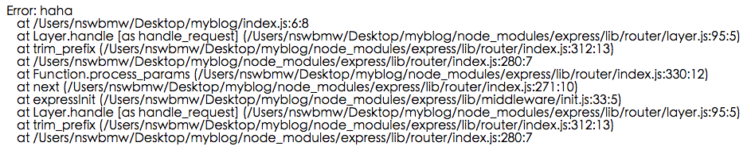

前面我们讲解了 express 中路由和模板引擎 ejs 的用法，但 express 的精髓并不在此，在于中间件的设计理念。

## 3.4.1 中间件与 next

express 中的中间件（middleware）就是用来处理请求的，当一个中间件处理完，可以通过调用 `next()` 传递给下一个中间件，如果没有调用 `next()`，则请求不会往下传递，如内置的 `res.render` 其实就是渲染完 html 直接返回给客户端，没有调用 `next()`，从而没有传递给下一个中间件。看个小例子，修改 index.js 如下：

**index.js**

```
var express = require('express');
var app = express();

app.use(function(req, res, next) {
  console.log('1');
  next();
});

app.use(function(req, res, next) {
  console.log('2');
  res.status(200).end();
});

app.listen(3000);
```

此时访问 `localhost:3000`，终端会输出：

```
1
2
```

通过 `app.use` 加载中间件，在中间件中通过 next 将请求传递到下一个中间件，next 可接受一个参数接收错误信息，如果使用了 `next(error)`，则会返回错误而不会传递到下一个中间件，修改 index.js 如下：

**index.js**

```
var express = require('express');
var app = express();

app.use(function(req, res, next) {
  console.log('1');
  next(new Error('haha'));
});

app.use(function(req, res, next) {
  console.log('2');
  res.status(200).end();
});

app.listen(3000);
```

此时访问 `localhost:3000`，终端会输出错误信息：


浏览器会显示：



> 小提示：`app.use` 有非常灵活的使用方式，详情见 [官方文档](http://expressjs.com/en/4x/api.html#app.use)。

express 有成百上千的第三方中间件，在开发过程中我们首先应该去 npm 上寻找是否有类似实现的中间件，尽量避免造轮子，节省开发时间。下面给出几个常用的搜索 npm 模块的网站：

1. [http://npmjs.com](http://npmjs.com)(npm 官网)
2. [http://node-modules.com](http://node-modules.com)
3. [https://npms.io](https://npms.io)
4. [https://nodejsmodules.org](https://nodejsmodules.org)

> 小提示：express@4 之前的版本基于 connect 这个模块实现的中间件的架构，express@4 及以上的版本则移除了对 connect 的依赖自己实现了，理论上基于 connect 的中间件（通常以 `connect-` 开头，如 `connect-mongo`）仍可结合 express 使用。

> 注意：中间件的加载顺序很重要！比如：通常把日志中间件放到比较靠前的位置，后面将会介绍的 `connect-flash` 中间件是基于 session 的，所以需要在 `express-session` 后加载。

## 3.4.2 错误处理

上面的例子中，应用程序为我们自动返回了错误栈信息（express 内置了一个默认的错误处理器），假如我们想手动控制返回的错误内容，则需要加载一个自定义错误处理的中间件，修改 index.js 如下：

**index.js**

```
var express = require('express');
var app = express();

app.use(function(req, res, next) {
  console.log('1');
  next(new Error('haha'));
});

app.use(function(req, res, next) {
  console.log('2');
  res.status(200).end();
});

//错误处理
app.use(function(err, req, res, next) {
  console.error(err.stack);
  res.status(500).send('Something broke!');
});

app.listen(3000);
```

此时访问 `localhost:3000`，浏览器会显示 `Something broke!`。

> 小提示：关于 express 的错误处理，详情见 [官方文档](http://expressjs.com/en/guide/error-handling.html)。

上一节：[3.3 模板引擎](https://github.com/nswbmw/N-blog/blob/master/book/3.3%20%E6%A8%A1%E6%9D%BF%E5%BC%95%E6%93%8E.md)

下一节：[4.1 开发环境](https://github.com/nswbmw/N-blog/blob/master/book/4.1%20%E5%BC%80%E5%8F%91%E7%8E%AF%E5%A2%83.md)