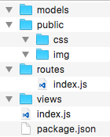

## 4.2.1 目录结构

我们停止 supervisor 并删除 myblog 目录从头来过。重新创建 myblog，运行 `npm init`，如下：


在 myblog 目录下创建以下目录及空文件（package.json 除外）：



对应文件及文件夹的用处：

1. `models`: 存放操作数据库的文件
2. `public`: 存放静态文件，如样式、图片等
3. `routes`: 存放路由文件
4. `views`: 存放模板文件
5. `index.js`: 程序主文件
6. `package.json`: 存储项目名、描述、作者、依赖等等信息

> 小提示：不知读者发现了没有，我们遵循了 MVC（模型(model)－视图(view)－控制器(controller/route)） 的开发模式。

## 4.2.2 安装依赖模块 

运行以下命令安装所需模块：

```
npm i config-lite connect-flash connect-mongo ejs express express-formidable express-session marked moment mongolass objectid-to-timestamp sha1 winston express-winston --save
```

对应模块的用处：

1. `express`: web 框架
2. `express-session`: session 中间件
3. `connect-mongo`: 将 session 存储于 mongodb，结合 express-session 使用
4. `connect-flash`: 页面通知提示的中间件，基于 session 实现
5. `ejs`: 模板
6. `express-formidable`: 接收表单及文件的上传中间件
7. `config-lite`: 读取配置文件
8. `marked`: markdown 解析
9. `moment`: 时间格式化
10. `mongolass`: mongodb 驱动
11. `objectid-to-timestamp`: 根据 ObjectId 生成时间戳
12. `sha1`: sha1 加密，用于密码加密
13. `winston`: 日志
14. `express-winston`: 基于 winston 的用于 express 的日志中间件

后面会详细讲解这些模块的用处。

上一节：[4.1 开发环境](https://github.com/nswbmw/N-blog/blob/master/book/4.1%20%E5%BC%80%E5%8F%91%E7%8E%AF%E5%A2%83.md)

下一节：[4.3 配置文件](https://github.com/nswbmw/N-blog/blob/master/book/4.3%20%E9%85%8D%E7%BD%AE%E6%96%87%E4%BB%B6.md)
