我们使用 jQuery + Semantic-UI 实现前端页面的设计，最终效果图如下:

**注册页**

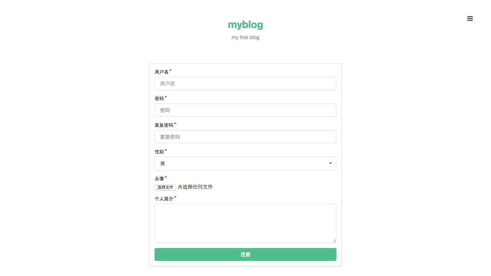

**登录页**

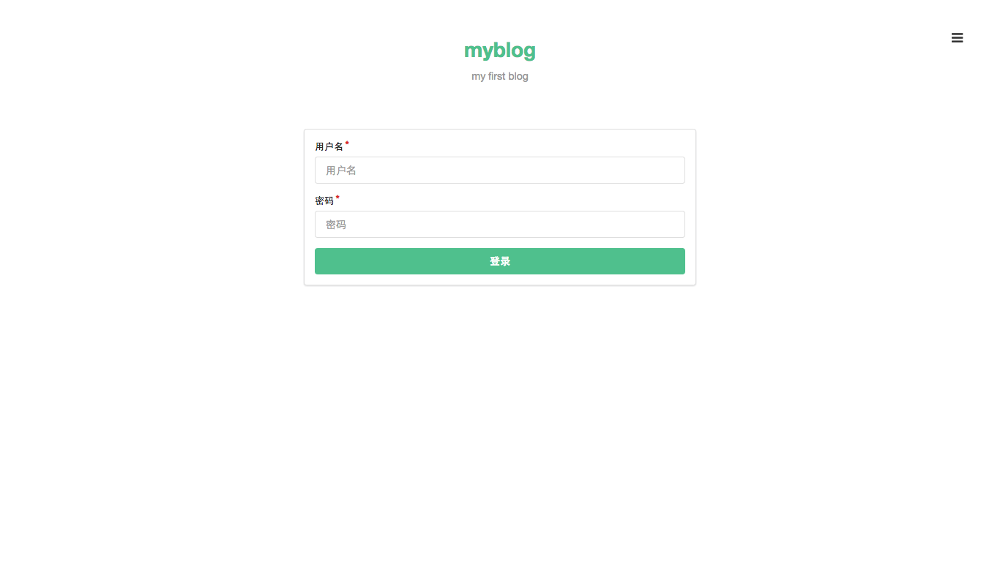

**未登录时的主页（或用户页）**

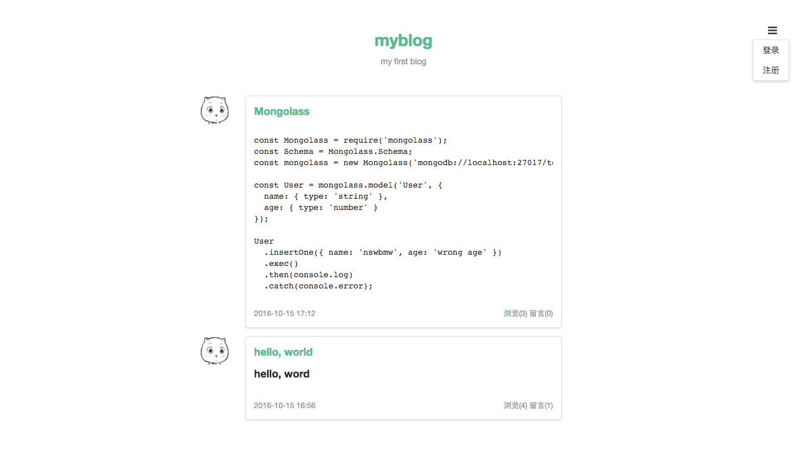

**登录后的主页（或用户页）**


**发表文章页**

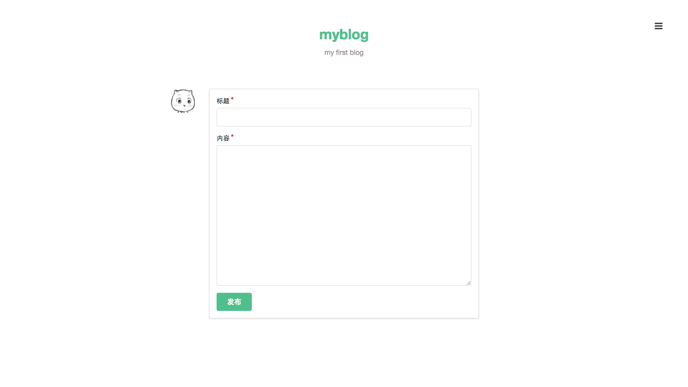

**编辑文章页**

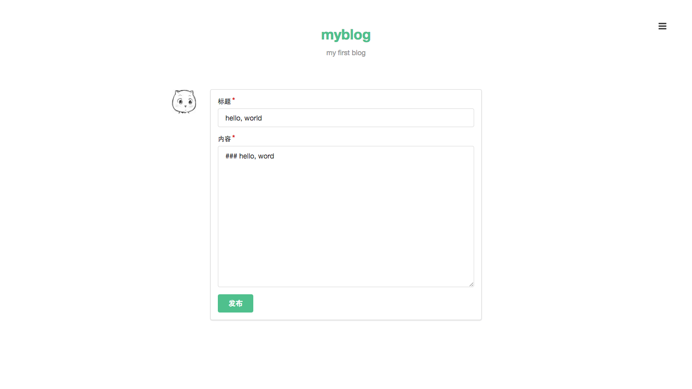

**未登录时的文章页**

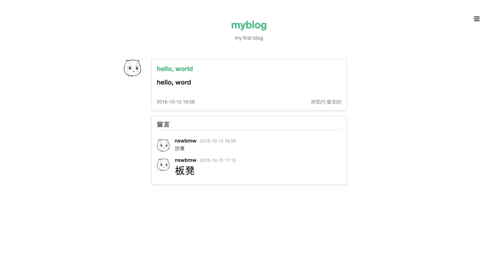

**登录后的文章页**

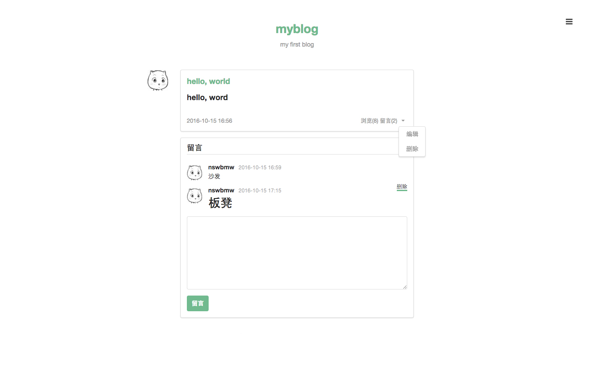

**通知**

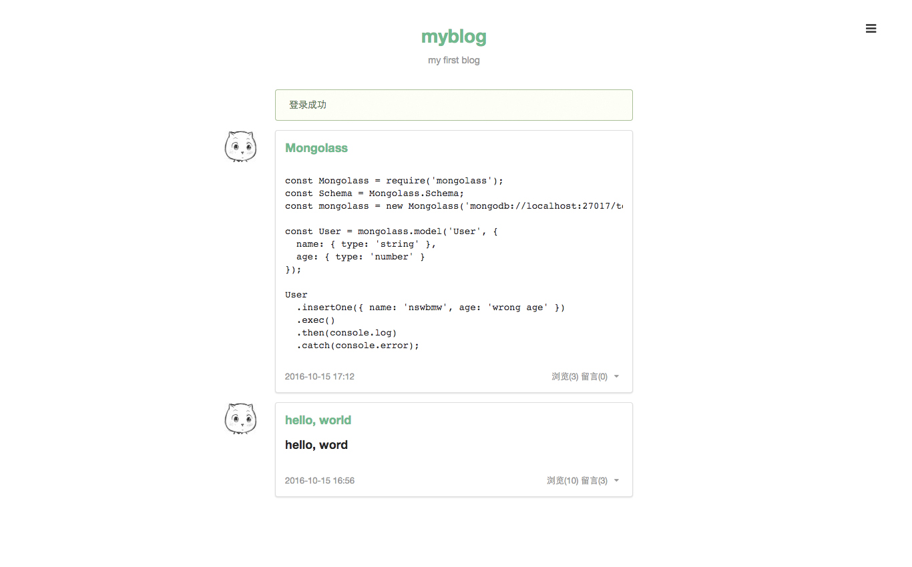
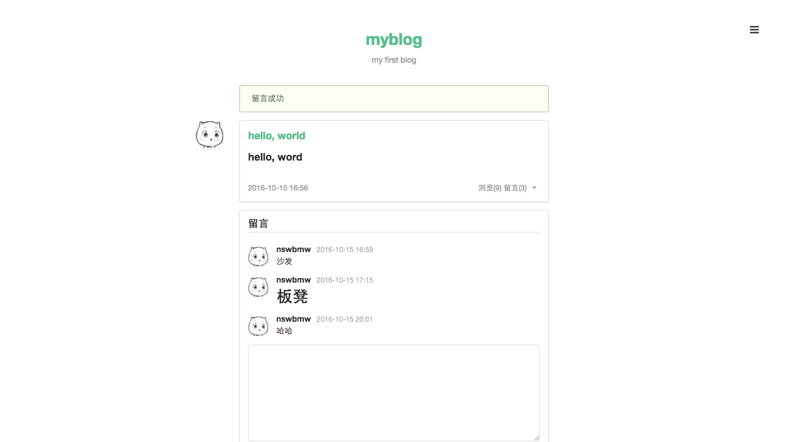
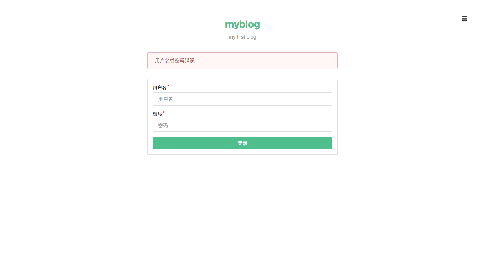

## 4.5.1 组件

前面提到过，我们可以将模板拆分成一些组件，然后使用 ejs 的 include 方法将组件组合起来进行渲染。我们将页面切分成以下组件：

**主页**

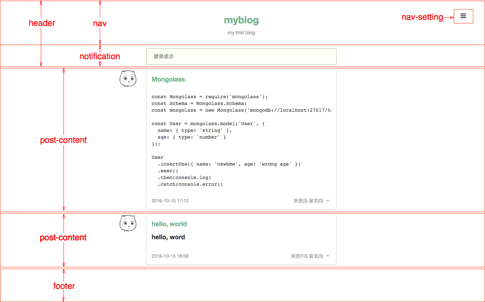

**文章页**

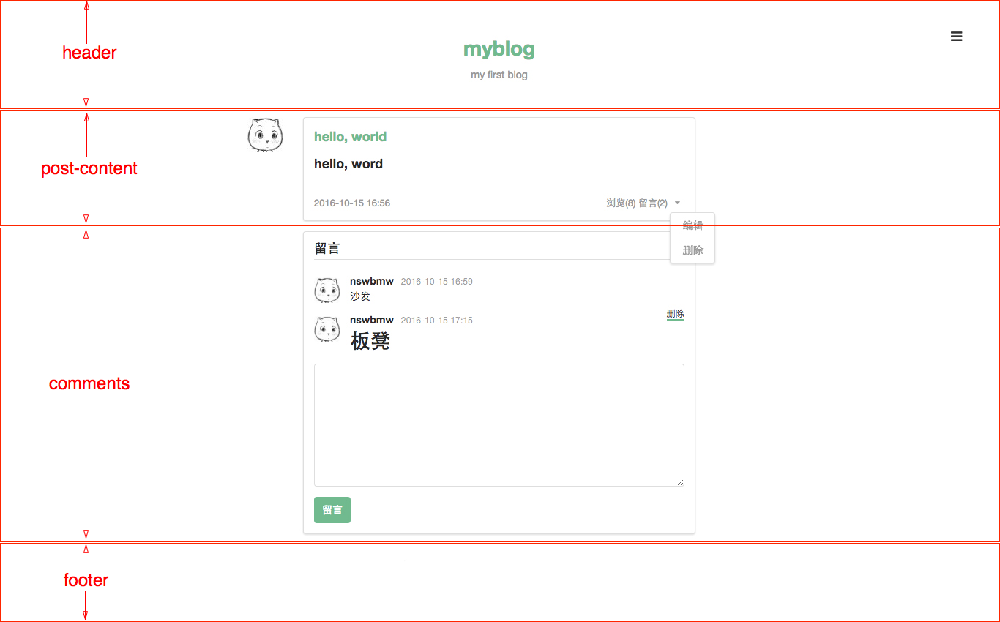

根据上面的组件切分图，我们创建以下样式及模板文件：

**public/css/style.css**

```
/* ---------- 全局样式 ---------- */

body {
  width: 1100px;
  height: 100%;
  margin: 0 auto;
  padding-top: 40px;
}

a:hover {
  border-bottom: 3px solid #4fc08d;
}

.button {
  background-color: #4fc08d !important;
  color: #fff !important;
}

.avatar {
  border-radius: 3px;
  width: 48px;
  height: 48px;
  float: right;
}

/* ---------- nav ---------- */

.nav {
  margin-bottom: 20px;
  color: #999;
  text-align: center;
}

.nav h1 {
  color: #4fc08d;
  display: inline-block;
  margin: 10px 0;
}

/* ---------- nav-setting ---------- */

.nav-setting {
  position: fixed;
  right: 30px;
  top: 35px;
  z-index: 999;
}

.nav-setting .ui.dropdown.button {
  padding: 10px 10px 0 10px;
  background-color: #fff !important;
}

.nav-setting .icon.bars {
  color: #000;
  font-size: 18px;
}

/* ---------- post-content ---------- */

.post-content h3 a {
  color: #4fc08d !important;
}

.post-content .tag {
  font-size: 13px;
  margin-right: 5px;
  color: #999;
}

.post-content .tag.right {
  float: right;
  margin-right: 0;
}

.post-content .tag.right a {
  color: #999;
}
```

**views/header.ejs**

```
<!DOCTYPE html>
<html>
  <head>
    <meta charset="utf-8">
    <title><%= blog.title %></title>
    <link rel="stylesheet" href="//cdn.bootcss.com/semantic-ui/2.1.8/semantic.min.css">
    <link rel="stylesheet" href="/css/style.css">
    <script src="//cdn.bootcss.com/jquery/1.11.3/jquery.min.js"></script>
    <script src="//cdn.bootcss.com/semantic-ui/2.1.8/semantic.min.js"></script>
  </head>
  <body>
  <%- include('components/nav') %>
  <%- include('components/nav-setting') %>
  <%- include('components/notification') %>
```

**views/footer.ejs**

```
  <script type="text/javascript">
    // 点击按钮弹出下拉框
    $('.ui.dropdown').dropdown();
    // 鼠标悬浮在头像上，弹出气泡提示框
    $('.post-content .avatar').popup({
      inline: true,
      position: 'bottom right',
      lastResort: 'bottom right',
    });
  </script>
  </body>
</html>
```

> 注意：上面 `<script></script>` 是 semantic-ui 操控页面控件的代码，一定要放到 footer.ejs 的 `</body>` 的前面，因为只有页面加载完后才能通过 JQuery 获取 DOM 元素。

在 views 目录下新建 components 目录用来存放组件，在该目录下创建以下文件：

**views/components/nav.ejs**

```
<div class="nav">
  <div class="ui grid">
    <div class="four wide column"></div>

    <div class="eight wide column">
      <a href="/posts"><h1><%= blog.title %></h1></a>
      <p><%= blog.description %></p>
    </div>
  </div>
</div>
```

**views/components/nav-setting.ejs**

```
<div class="nav-setting">
  <div class="ui buttons">
    <div class="ui floating dropdown button">
      <i class="icon bars"></i>
      <div class="menu">
        <% if (user) { %>
          <a class="item" href="/posts?author=<%= user._id %>">个人主页</a>
          <div class="divider"></div>
          <a class="item" href="/posts/create">发表文章</a>
          <a class="item" href="/signout">登出</a>
        <% } else { %>
          <a class="item" href="/signin">登录</a>
          <a class="item" href="/signup">注册</a>
        <% } %>
      </div>
    </div>
  </div>
</div>
```

**views/components/notification.ejs**

```
<div class="ui grid">
  <div class="four wide column"></div>
  <div class="eight wide column">

  <% if (success) { %>
    <div class="ui success message">
      <p><%= success %></p>
    </div>
  <% } %>

  <% if (error) { %>
    <div class="ui error message">
      <p><%= error %></p>
    </div>
  <% } %>

  </div>
</div>
```

## 4.5.2 app.locals 和 res.locals

上面的模板中我们用到了 blog、user、success、error 变量，我们将 blog 变量挂载到 `app.locals` 下，将 user、success、error 挂载到 `res.locals` 下。为什么要这么做呢？`app.locals` 和 `res.locals` 是什么？它们有什么区别？

express 中有两个对象可用于模板的渲染：`app.locals` 和 `res.locals`。我们从 express 源码一探究竟：

**express/lib/application.js**

```
app.render = function render(name, options, callback) {
  ...
  var opts = options;
  var renderOptions = {};
  ...
  // merge app.locals
  merge(renderOptions, this.locals);

  // merge options._locals
  if (opts._locals) {
    merge(renderOptions, opts._locals);
  }

  // merge options
  merge(renderOptions, opts);
  ...
  tryRender(view, renderOptions, done);
};
```

**express/lib/response.js**

```
res.render = function render(view, options, callback) {
  var app = this.req.app;
  var opts = options || {};
  ...
  // merge res.locals
  opts._locals = self.locals;
  ...
  // render
  app.render(view, opts, done);
};
```

可以看出：在调用 `res.render` 的时候，express 合并（merge）了 3 处的结果后传入要渲染的模板，优先级：`res.render` 传入的对象> `res.locals` 对象 > `app.locals` 对象，所以 `app.locals` 和 `res.locals` 几乎没有区别，都用来渲染模板，使用上的区别在于：`app.locals` 上通常挂载常量信息（如博客名、描述、作者信息），`res.locals` 上通常挂载变量信息，即每次请求可能的值都不一样（如请求者信息，`res.locals.user = req.session.user`）。

修改 index.js，在 `routes(app);` 上一行添加如下代码：

```
// 设置模板全局常量
app.locals.blog = {
  title: pkg.name,
  description: pkg.description
};

// 添加模板必需的三个变量
app.use(function (req, res, next) {
  res.locals.user = req.session.user;
  res.locals.success = req.flash('success').toString();
  res.locals.error = req.flash('error').toString();
  next();
});
```

这样在调用 `res.render` 的时候就不用传入这四个变量了，express 为我们自动 merge 并传入了模板，所以我们可以在模板中直接使用这四个变量。

上一节：[4.4 功能设计](https://github.com/nswbmw/N-blog/blob/master/book/4.4%20%E5%8A%9F%E8%83%BD%E8%AE%BE%E8%AE%A1.md)

下一节：[4.6 连接数据库](https://github.com/nswbmw/N-blog/blob/master/book/4.6%20%E8%BF%9E%E6%8E%A5%E6%95%B0%E6%8D%AE%E5%BA%93.md)