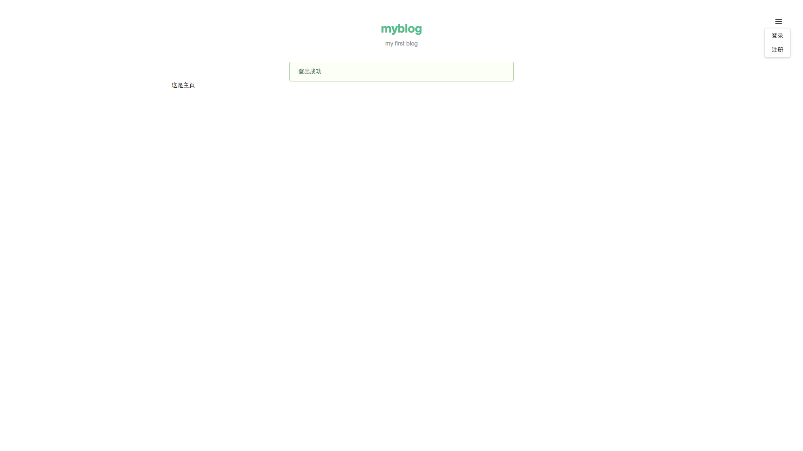
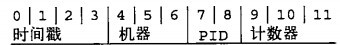
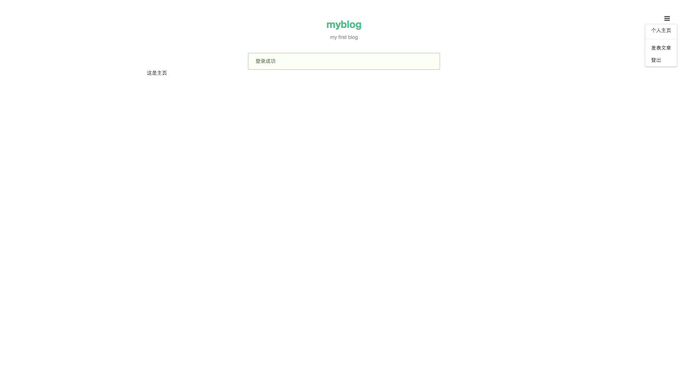

## 4.8.1 登出

现在我们来完成登出的功能。修改 routes/signout.js 如下：

**routes/signout.js**

```js
const express = require('express')
const router = express.Router()

const checkLogin = require('../middlewares/check').checkLogin

// GET /signout 登出
router.get('/', checkLogin, function (req, res, next) {
  // 清空 session 中用户信息
  req.session.user = null
  req.flash('success', '登出成功')
  // 登出成功后跳转到主页
  res.redirect('/posts')
})

module.exports = router
```

此时刷新页面，点击右上角的 `登出`，成功后如下图所示：



## 4.8.2 登录页

现在我们来完成登录页。修改 routes/signin.js 相应代码如下：

**routes/signin.js**

```js
router.get('/', checkNotLogin, function (req, res, next) {
  res.render('signin')
})
```

新建 views/signin.ejs，添加如下代码：

**views/signin.ejs**

```ejs
<%- include('header') %>

<div class="ui grid">
  <div class="four wide column"></div>
  <div class="eight wide column">
    <form class="ui form segment" method="post">
      <div class="field required">
        <label>用户名</label>
        <input placeholder="用户名" type="text" name="name">
      </div>
      <div class="field required">
        <label>密码</label>
        <input placeholder="密码" type="password" name="password">
      </div>
      <input type="submit" class="ui button fluid" value="登录">
    </form>  
  </div>
</div>

<%- include('footer') %>
```

现在刷新页面，点击右边上角 `登录` 试试吧，我们已经看到了登录页，但先不要点击登录，接下来我们实现处理登录的逻辑。

## 4.8.3 登录

现在我们来完成登录的功能。修改 models/users.js 添加 `getUserByName` 方法用于通过用户名获取用户信息：

**models/users.js**

```js
const User = require('../lib/mongo').User

module.exports = {
  // 注册一个用户
  create: function create (user) {
    return User.create(user).exec()
  },

  // 通过用户名获取用户信息
  getUserByName: function getUserByName (name) {
    return User
      .findOne({ name: name })
      .addCreatedAt()
      .exec()
  }
}
```

这里我们使用了 `addCreatedAt` 自定义插件（通过 \_id 生成时间戳），修改 lib/mongo.js，添加如下代码：

**lib/mongo.js**

```js
const moment = require('moment')
const objectIdToTimestamp = require('objectid-to-timestamp')

// 根据 id 生成创建时间 created_at
mongolass.plugin('addCreatedAt', {
  afterFind: function (results) {
    results.forEach(function (item) {
      item.created_at = moment(objectIdToTimestamp(item._id)).format('YYYY-MM-DD HH:mm')
    })
    return results
  },
  afterFindOne: function (result) {
    if (result) {
      result.created_at = moment(objectIdToTimestamp(result._id)).format('YYYY-MM-DD HH:mm')
    }
    return result
  }
})
```

> 小提示：24 位长的 ObjectId 前 4 个字节是精确到秒的时间戳，所以我们没有额外的存创建时间（如: createdAt）的字段。ObjectId 生成规则：




修改 routes/signin.js 如下：

**routes/signin.js**

```js
const sha1 = require('sha1')
const express = require('express')
const router = express.Router()

const UserModel = require('../models/users')
const checkNotLogin = require('../middlewares/check').checkNotLogin

// GET /signin 登录页
router.get('/', checkNotLogin, function (req, res, next) {
  res.render('signin')
})

// POST /signin 用户登录
router.post('/', checkNotLogin, function (req, res, next) {
  const name = req.fields.name
  const password = req.fields.password

  // 校验参数
  try {
    if (!name.length) {
      throw new Error('请填写用户名')
    }
    if (!password.length) {
      throw new Error('请填写密码')
    }
  } catch (e) {
    req.flash('error', e.message)
    return res.redirect('back')
  }

  UserModel.getUserByName(name)
    .then(function (user) {
      if (!user) {
        req.flash('error', '用户不存在')
        return res.redirect('back')
      }
      // 检查密码是否匹配
      if (sha1(password) !== user.password) {
        req.flash('error', '用户名或密码错误')
        return res.redirect('back')
      }
      req.flash('success', '登录成功')
      // 用户信息写入 session
      delete user.password
      req.session.user = user
      // 跳转到主页
      res.redirect('/posts')
    })
    .catch(next)
})

module.exports = router
```

这里我们在 POST /signin 的路由处理函数中，通过传上来的 name 去数据库中找到对应用户，校验传上来的密码是否跟数据库中的一致。不一致则返回上一页（即登录页）并显示『用户名或密码错误』的通知，一致则将用户信息写入 session，跳转到主页并显示『登录成功』的通知。

现在刷新页面，点击右上角 `登录`，用刚才注册的账号登录，如下图所示：



上一节：[4.7 注册](https://github.com/nswbmw/N-blog/blob/master/book/4.7%20%E6%B3%A8%E5%86%8C.md)

下一节：[4.9 文章](https://github.com/nswbmw/N-blog/blob/master/book/4.9%20%E6%96%87%E7%AB%A0.md)
